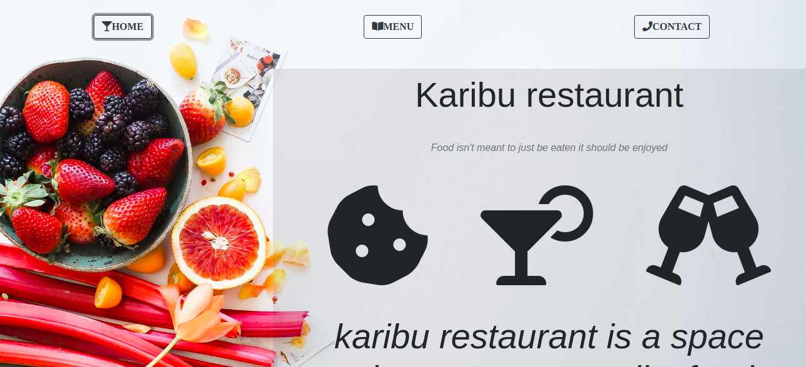

# Restaurant page

> This repo contains an implementation of a restaurant page by using javaScript to dynamically add the content.



## Built With

- javaScript,
- Html,
- css,
- boostrap,
- webpack

## Live Demo

[Live Demo Link](https://livedemo.com)


## Getting Started

To get a local copy up and running follow these simple example steps.

### Prerequisites
make sure you have node and npm istalled on you local computer
### clone the repo by typing
```git cloce 
```
### Install
run 
```npm install
```
to get the dependencies
open your local server and you shpu;d be good to go

## Authors

👤 **tresor**

- Github: [@Tresor11](https://github.com/Tresor11)
- Twitter: [@Tbireke](https://twitter.com/Tbireke)

## 🤝 Contributing

Contributions, issues and feature requests are welcome!

Feel free to check the [issues page](issues/).

## Show your support

Give a ⭐️ if you like this project!

## 📝 License

This project is [MIT](lic.url) licensed.
